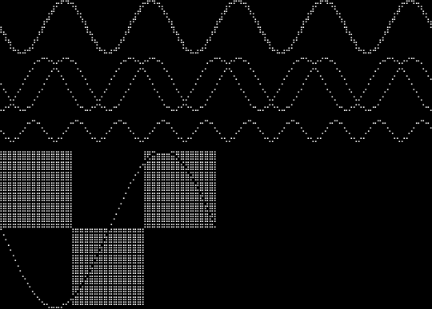
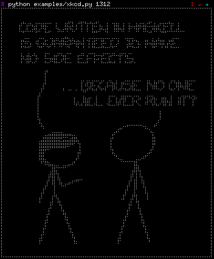
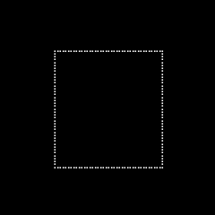
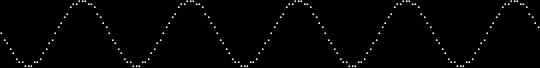
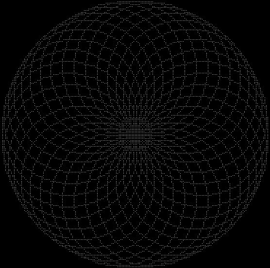

# DRAWILLE

Drawing in terminal with Unicode [Braille](http://en.wikipedia.org/wiki/Braille) characters.

A [go](https://golang.org) port of [asciimoo's](https://github.com/asciimoo) [drawille](https://github.com/asciimoo/drawille)






## USAGE

```go
const RAD = math.Pi / 180

c := drawille.NewCanvas()

for x := 0; x < 1800; x += 10 {
    c.Set(float64(x)/10, 10 + 10*math.Sin(float64(x)*RAD))
}
fmt.Print(c)
```



```go
const RAD = math.Pi / 180

t := drawille.NewTurtle()

for range [36]struct{}{} {
    t.Right(10)
    for range [36]struct{}{} {
        t.Right(10)
        t.Forward(8)
    }
}
fmt.Print(t)
```


